# Nix Darwin Kickstarter

[](https://github.com/ryan4yin/nix-darwin-kickstarter/actions/workflows/ci.yml)
[](https://github.com/ryan4yin/nix-darwin-kickstarter/actions)
[](https://github.com/ryan4yin/nix-darwin-kickstarter/actions/workflows/deploy.yml)

An easy-to-understand nix-darwin + home-manager + flakes startup configuration for beginners with complete CI/CD automation.

The main purpose of this repository is to help beginners understand the basic configuration of nix-darwin, and to help them quickly start their own nix-darwin configuration.


Two versions of the template are provided here:

- [minimal](./minimal): A minimal configuration that only contains the necessary configuration to start using nix-darwin, and can be safely deployed to your own system.
- [rich-demo](./rich-demo): A rich demo that contains a lot of configuration that can be used as a reference for your own configuration, but it may **OVERWRITE** your system configuration, so **DO NOT** deploy it to your own system directly.


## 🚀 Quick Start

### Automated Deployment

Use our automated deployment script for a seamless setup:

```bash
# Clone the repository
git clone https://github.com/ryan4yin/nix-darwin-kickstarter.git
cd nix-darwin-kickstarter

# Deploy minimal configuration (recommended for beginners)
./scripts/deploy.sh

# Or deploy rich-demo configuration (advanced users)
./scripts/deploy.sh --config rich-demo --hostname your-hostname
```

### Manual Deployment

For manual control over the deployment process:

```bash
# Navigate to your preferred configuration
cd minimal  # or cd rich-demo

# First time setup
nix run nix-darwin -- switch --flake .#zeds

# Regular updates
darwin-rebuild switch --flake .#zeds
```

## 🔄 CI/CD Pipeline

This project includes a complete CI/CD pipeline that:

- ✅ **Validates configurations** on every push and PR
- 🔒 **Security scanning** with Trivy vulnerability detection
- 🧹 **Code quality checks** with linting and formatting
- 📦 **Automated dependency updates** via Dependabot
- 🚀 **Deployment notifications** with detailed instructions
- 🔙 **Automatic rollback** capabilities

### Pipeline Flow

```mermaid
graph LR
    A[本地修改] --> B[Push to GitHub]
    B --> C[GitHub Actions 验证]
    C --> D{构建成功?}
    D -->|是| E[本地 Pull & 部署]
    D -->|否| F[修复问题]
    F --> A
```



## Why nix-darwin

With nix-darwin, you can manage your macOS system configuration & dotfiles in a declarative way, and you can easily rollback to any previous configuration.
It's also easy to share your configuration with others, and you can easily manage multiple macOS hosts.

### Benefits of This Setup

- 🔧 **Reproducible builds** - Same configuration works across different machines
- 🛡️ **Automated testing** - Every change is validated before deployment
- 📋 **Easy rollbacks** - Quickly revert to previous working configurations
- 🔄 **Continuous updates** - Dependencies automatically updated and tested
- 📚 **Documentation** - Clear deployment and troubleshooting guides

## 🛠️ Advanced Usage

### Setting Up CI/CD for Your Fork

If you fork this repository, you can set up the CI/CD pipeline for your own project:

```bash
# Run the setup script to configure GitHub repository features
./scripts/setup-ci.sh
```

This will:
- Enable GitHub Actions workflows
- Set up branch protection rules
- Create issue and PR templates
- Configure security features
- Set up Dependabot for automated updates

### Customizing Configurations

1. **Minimal Configuration**: Edit files in `minimal/modules/`
2. **Rich Demo Configuration**: Edit files in `rich-demo/modules/` and `rich-demo/home/`
3. **Testing Changes**: Use `./scripts/deploy.sh --dry-run` to validate without applying

### Managing Multiple Hosts

```bash
# Create host-specific configurations
cp -r minimal my-macbook-config
cd my-macbook-config

# Update flake.nix with your hostname
vim flake.nix

# Deploy to specific host
darwin-rebuild switch --flake .#my-macbook
```

## 🔧 Troubleshooting

### Common Issues

**Build Failures:**
```bash
# Check flake syntax
nix flake check

# Validate configuration
nix build .#darwinConfigurations.your-hostname.system --dry-run
```

**Permission Issues:**
```bash
# Fix Nix store permissions
sudo chown -R $(whoami) /nix
```

**Rollback Failed Deployment:**
```bash
# List available generations
sudo nix-env --list-generations --profile /nix/var/nix/profiles/system

# Rollback to previous generation
sudo nix-env --rollback --profile /nix/var/nix/profiles/system
```

**Clear Cache:**
```bash
# Clean up old generations and free space
nix-collect-garbage -d
sudo nix-collect-garbage -d
```

### Getting Help

- 📖 [Nix Darwin Documentation](https://daiderd.com/nix-darwin/)
- 📚 [Nixos and Flakes Book](https://github.com/ryan4yin/nixos-and-flakes-book)
- 💬 [GitHub Discussions](https://github.com/ryan4yin/nix-darwin-kickstarter/discussions)
- 🐛 [Report Issues](https://github.com/ryan4yin/nix-darwin-kickstarter/issues)

## 📄 License

This project is licensed under the MIT License - see the [LICENSE](LICENSE) file for details.

## 🤝 Contributing

Contributions are welcome! Please read our [Contributing Guide](CONTRIBUTING.md) for details on our code of conduct and the process for submitting pull requests.

### Development Workflow

1. Fork the repository
2. Create a feature branch: `git checkout -b feature/amazing-feature`
3. Make your changes and test them locally
4. Run validation: `./scripts/deploy.sh --dry-run`
5. Commit your changes: `git commit -m 'Add amazing feature'`
6. Push to the branch: `git push origin feature/amazing-feature`
7. Open a Pull Request

The CI/CD pipeline will automatically:
- Validate your configuration changes
- Run security scans
- Check code formatting
- Provide deployment instructions

---

**⭐ If this project helped you, please give it a star! ⭐**

