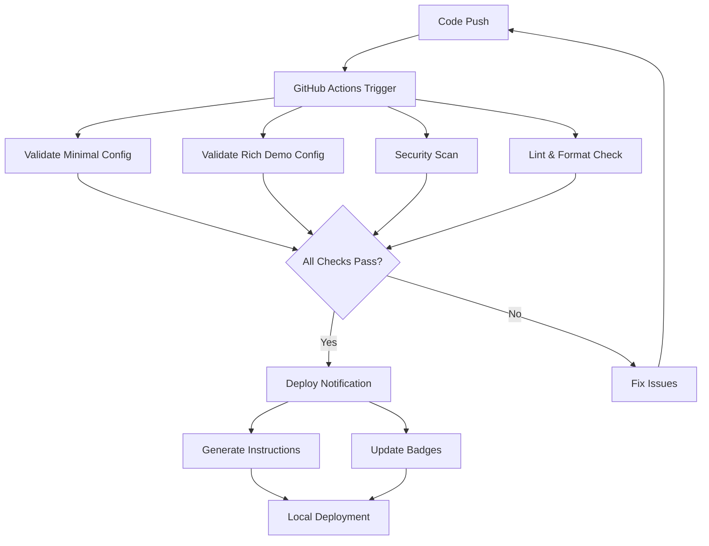

# CI/CD Pipeline Documentation

This document provides detailed information about the CI/CD pipeline setup for the Nix Darwin Kickstarter project.

## 📋 Overview

The CI/CD pipeline provides comprehensive automation for:
- Configuration validation
- Security scanning
- Code quality checks
- Automated deployments
- Dependency management

## 🔄 Workflow Architecture

### Main Workflows

#### 1. CI/CD Pipeline (`.github/workflows/ci.yml`)

**Triggers:**
- Push to `main` or `develop` branches
- Pull requests to `main` branch

**Jobs:**

1. **validate-minimal**
   - Validates minimal configuration syntax
   - Performs dry-run build
   - Checks Nix formatting

2. **validate-rich-demo**
   - Validates rich-demo configuration
   - Updates hostnames for CI testing
   - Performs dry-run build

3. **security-scan**
   - Runs Trivy vulnerability scanner
   - Uploads results to GitHub Security tab
   - SARIF format reporting

4. **lint-and-format**
   - Markdown linting with markdownlint
   - YAML validation with yamllint
   - Nix code formatting checks

5. **build-success-notification**
   - Sends success notifications
   - Only runs on successful main branch builds

6. **auto-merge-dependabot**
   - Automatically merges Dependabot PRs
   - Only for minor/patch updates

#### 2. Deploy Notification (`.github/workflows/deploy.yml`)

**Triggers:**
- Completion of CI/CD Pipeline workflow
- Only on successful runs for main branch

**Jobs:**

1. **deploy-notification**
   - Creates detailed deployment instructions
   - Uploads deployment artifact
   - Comments on PRs with instructions

2. **update-readme-badge**
   - Updates README.md with status badges
   - Commits changes automatically

#### 3. Dependabot Auto-merge (`.github/workflows/dependabot-auto-merge.yml`)

**Triggers:**
- Dependabot pull requests

**Features:**
- Auto-approves minor and patch updates
- Enables auto-merge for safe updates
- Requires CI checks to pass

### Configuration Files

#### Dependabot (`.github/dependabot.yml`)
- Weekly GitHub Actions updates
- Automatic security updates
- Configured reviewers and assignees

#### Linting Configurations
- `.markdownlint.json` - Markdown style rules
- `.yamllint.yml` - YAML formatting standards

## 🚀 Deployment Process

### Automated Flow



### Manual Deployment

Users can deploy locally using:

```bash
# Automated script
./scripts/deploy.sh

# Manual process
cd minimal
darwin-rebuild switch --flake .#hostname
```

## 🔧 Setup Scripts

### `scripts/deploy.sh`

**Features:**
- Prerequisite checking
- Configuration backup
- Validation before deployment
- Detailed logging and error handling
- Rollback capabilities

**Usage:**
```bash
./scripts/deploy.sh [OPTIONS]
-c, --config TYPE       # Configuration type (minimal|rich-demo)
-h, --hostname NAME     # Hostname for configuration
-d, --directory DIR     # Target directory
--no-backup            # Skip backup creation
--dry-run              # Validate without applying
```

### `scripts/setup-ci.sh`

**Features:**
- GitHub repository configuration
- Branch protection setup
- Issue template creation
- Security feature enablement

**Usage:**
```bash
./scripts/setup-ci.sh
```

## 🔒 Security Features

### Vulnerability Scanning
- **Tool**: Trivy
- **Scope**: Filesystem scanning
- **Format**: SARIF for GitHub Security tab
- **Frequency**: Every push and PR

### Branch Protection
- **Required status checks**
- **Dismiss stale reviews**
- **Restrict force pushes**
- **Prevent deletions**

### Automated Security Updates
- **Dependabot integration**
- **Auto-merge for safe updates**
- **Security alert enablement**

## 📊 Monitoring and Notifications

### Status Badges
- CI/CD Pipeline status
- Security scan results
- Deploy status

### Notifications
- Build success/failure
- Security vulnerabilities
- Deployment instructions

### Artifacts
- Deployment instructions (30-day retention)
- Security scan results
- Build logs

## 🛠️ Customization

### Adding New Checks

1. **Extend ci.yml workflow:**
```yaml
new-check:
  name: My Custom Check
  runs-on: ubuntu-latest
  steps:
    - uses: actions/checkout@v4
    - name: Run custom check
      run: ./my-check-script.sh
```

2. **Update branch protection:**
```bash
# Add to required_status_checks in setup-ci.sh
"My Custom Check"
```

### Environment-Specific Configurations

Create environment-specific secrets:
- `PROD_DEPLOY_KEY` - Production deployment
- `STAGING_CONFIG` - Staging configuration
- `CUSTOM_CACHE_TOKEN` - Custom cache access

### Custom Deployment Targets

Extend deploy.sh for multiple environments:
```bash
case "$ENVIRONMENT" in
  "production")
    CONFIG_PATH="configs/prod"
    ;;
  "staging")
    CONFIG_PATH="configs/staging"
    ;;
esac
```

## 🐛 Troubleshooting

### Common CI/CD Issues

1. **Build Failures**
   - Check flake syntax: `nix flake check`
   - Validate locally: `./scripts/deploy.sh --dry-run`
   - Review error logs in GitHub Actions

2. **Permission Errors**
   - Verify GitHub token permissions
   - Check repository settings
   - Ensure proper branch protection

3. **Caching Issues**
   - Clear GitHub Actions cache
   - Regenerate Cachix tokens
   - Review cache configuration

### Debugging Steps

1. **Local Reproduction:**
```bash
# Reproduce CI environment locally
nix develop
./scripts/deploy.sh --dry-run
```

2. **Workflow Debugging:**
```yaml
# Add debug step to workflow
- name: Debug Environment
  run: |
    echo "Environment variables:"
    env | sort
    echo "File system:"
    ls -la
```

3. **Security Scan Issues:**
```bash
# Run Trivy locally
docker run --rm -v "$PWD:/workspace" aquasec/trivy fs /workspace
```

## 📈 Metrics and Analytics

### Success Metrics
- Build success rate
- Deployment frequency
- Time to deployment
- Security scan coverage

### Monitoring
- GitHub Actions usage
- Dependency update frequency
- Security vulnerability resolution time

## 🔮 Future Enhancements

### Planned Features
- Multi-platform support (Intel/Apple Silicon)
- Environment-specific configurations
- Performance benchmarking
- Integration testing

### Experimental Features
- Preview deployments for PRs
- Automated rollback on failure
- Configuration diff visualization
- Performance regression detection

---

This CI/CD setup provides a robust foundation for managing nix-darwin configurations with confidence and automation.